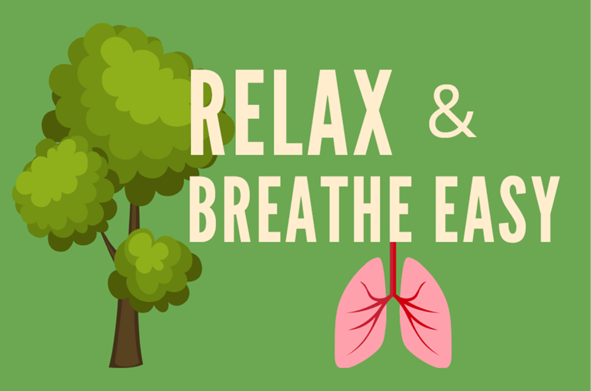

<!-- README.md is generated from README.Rmd. Please edit that file -->

# rbe.dashboard



<!-- badges: start -->

[](https://lifecycle.r-lib.org/articles/stages.html#experimental)

<!-- badges: end -->

rbe.dashboard is a Shiny app that displays data collected during the
2022 Relax & Breathe Easy study. This Shiny app was created using the
golem framework and can be installed locally as an R package. It is also
hosted on the web through shinyapps.io at
<https://nbrg.shinyapps.io/RBE_2022/>.

## Installation:

You can install the rbe.dashboard R package from GitHub:

``` r
library(devtools)

install_github("lisaerein/rbe.dashboard")
```

## Run the app:

``` r
library(rbe.dashboard)

run_app()
```
